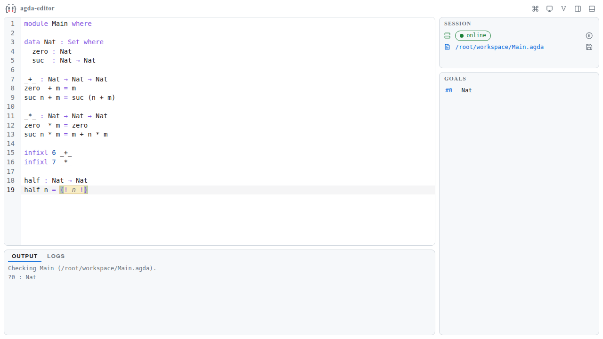
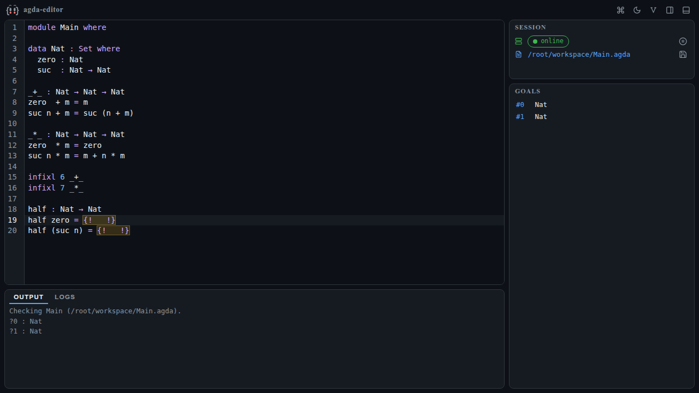
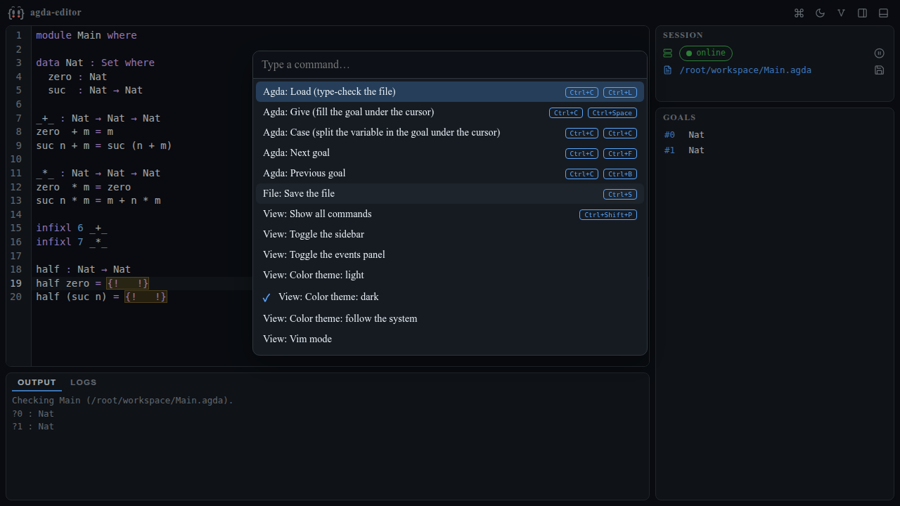

# Playground

My web app playground: small apps that run entirely in the browser — no local installation, no server — plus the shared packages they are built on. Everything is deployed as a purely static site: <https://huangjunwen.github.io/playground/>.

## What's here

### App

- **[agda-editor](apps/agda-editor/)** — an interactive [Agda](https://agda.readthedocs.io/) proof editor that runs entirely in the browser. It ships a WebAssembly build of the [Agda Language Server](https://github.com/agda/agda-language-server) running in a Web Worker: type-check the file, jump between goals, give expressions, case-split on variables — no local Agda installation needed. Installable as a PWA for offline use. ([documentation](apps/agda-editor/docs/index.md))

### Packages

Shared packages consumed by the app above (exported as TypeScript source, no build artifacts):

| Package | What it does |
| --- | --- |
| [`language-backend-agda`](packages/language-backend-agda/) | Starts ALS on any run environment and adapts its private `agda` LSP channel into a typed command/response API |
| [`run-env`](packages/run-env/) | A unified run environment interface: web WASI, Node WASI, and native binaries |
| [`wasip1`](packages/wasip1/) | A hand-rolled WASI Preview 1 runtime: main-thread host + Web Worker over RPC, with JSPI for blocking calls |
| [`lsp`](packages/lsp/) | A zero-dependency, transport-agnostic LSP client |
| [`vendor-assets`](packages/vendor-assets/) | A declarative registry and provisioning pipeline for vendored binaries, with runtime resolution to web URLs or Node paths |

## Screenshots

agda-editor — editing with a loaded goal (light theme), right after a case split (dark theme), and the command palette:

---

## Layout

- `apps/<app>/` — apps, build output deployed at `/<repo>/<app>/`
- `apps/<app>/docs/`, `packages/<pkg>/docs/` — per-component docs (Markdown), build output deployed at `/<repo>/docs/<name>/`
- `site/` — the site itself: landing page (`index.md`), static build (`build.mjs` + `template.html`), and dev/preview servers (`dev.mjs`, `serve.mjs`)
- `packages/` — shared packages (exported as TypeScript source, no build artifacts)

## Development

- `pnpm dev` — starts everything in parallel:
  - the site dev gateway at <http://127.0.0.1:4173/>: landing page + docs (rebuilt and auto-reloaded on Markdown changes), with apps reverse-proxied from their Vite dev servers (HMR included)
  - each app's Vite dev server (ports pinned in the app's `vite.config.ts`, registered in `site/dev.mjs`)
  - package sources are consumed directly by the dev servers, so package edits show up live in the running app
- `pnpm --filter <name> dev` — develop one component on its own (e.g. `pnpm --filter @playground/agda-editor dev`)

## Site build & production-like preview

`pnpm build:site` renders `site/index.md` and each `apps/*/docs` + `packages/*/docs` Markdown tree into static HTML under `_site/`:

- `site/index.md` → `_site/index.html` (landing page with app/package/doc entries)
- `<group>/<name>/docs/<file>.md` → `_site/docs/<name>/<file>.html`

Relative links between `.md` files are automatically rewritten to `.html`, so the sources read fine on GitHub too.

`pnpm preview:site` builds the app and the site, assembles `_site/` exactly like CI does, and serves everything at <http://127.0.0.1:4173/>. To re-serve an existing `_site/`: `node site/serve.mjs [port]`.

## Adding an app

1. Create the app under `apps/`; set the Vite `base` to `/playground/<app>/` for builds and `/`-relative for dev (see `apps/agda-editor/vite.config.ts`), pin `server.port` with `strictPort`, and register the mount in `site/dev.mjs`
2. Add build & copy steps in `.github/workflows/deploy-pages.yml` (copy into `_site/<app>/`)
3. Write docs under `apps/<app>/docs/` (`index.md` is the entry)
4. Add a card for it in the Apps section of `site/index.md`
